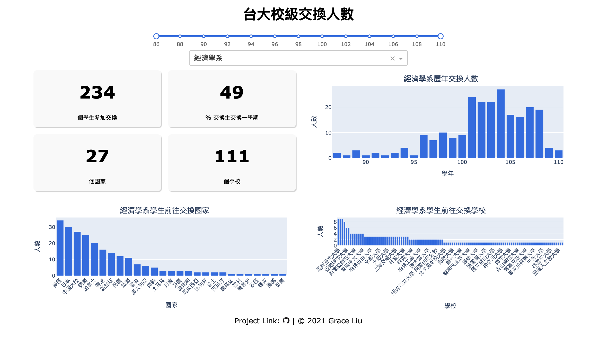

# NTU Excahnge Analysis


This is a [Dash](https://plotly.com/dash/) app visualizing the statisitcs of outbound exchange program at [National Taiwan University (NTU)](https://www.ntu.edu.tw/index.html).

The app answers questions like which countries students go to exchange, which universities students attended exchange, and how many students participated in exchange each year. The app allows users to select time range and department that they are interested in.

## Access the app
Click [here](https://ntu-exchange-analysis.herokuapp.com) to view the app. Note that this is the Mandarin version. Please click [here](https://ntu-exchange-analysis-eng.herokuapp.com) for the english version.

## Technologies
- [Dash](https://plotly.com/dash/) - Main server and interactive components
- [Plotly Python](https://plot.ly/python/) - Used to create the interactive plots
- [Heroku](https://heroku.com) - Cloud server for app deployment

## Data
The data is obtained from [Office of International Affairs, NTU](https://oia.ntu.edu.tw/students/outgoing.students.experience.do/).

## Running the app

First create a virtual environment with conda or venv inside a temp folder, then activate it.

```
virtualenv venv

# Windows
venv\Scripts\activate
# Or Linux
source venv/bin/activate

```

Clone the git repo, then install the requirements with pip

```

git clone https://github.com/grceliu/ntu-exchange-analysis.git
cd ntu-exchange-analysis
pip install -r requirements.txt

```

Run the app

```

python app.py

```
